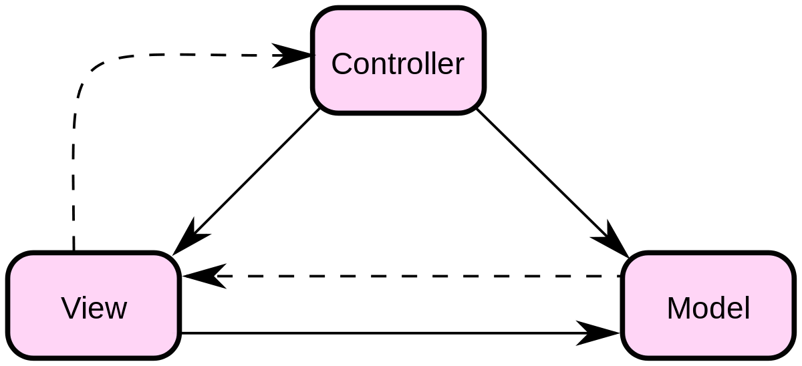

# 后端-项目结构
```shell
└─Spider-Community
    ├─src   // 工程源码目录
    |  ├─main
    |  |   ├─java   // java源代码目录
    |  |   |   └─com.example.spidercommunity
    |  |   |              ├─common     // 工具类目录
    |  |   |              ├─funs      // 功能模块java源代码目录
    |  |   |              └─SpiderCommunityAPP    // SpringBoot启动类
    |  |   └─resources
    |  |         ├─static
    |  |         ├─templates
    |  |         └─application.yml     //SpringBoot配置文件
    |  └─test      // 单元测试目录       
    ├─target      // 编译输出目录
    └─pom.xml   // maven项目配置文件        
```

# 后端-功能模块结构
```
以 login 模块为例：

└─login
    ├─dao   
    |  └─LoginDao      // dao层文件
    ├─impl  
    |  └─LoginServiceImpl   // Service接口实现类文件
    ├─LoginAPI     // controller层文件
    ├─LoginDto     // dto层文件
    ├─LoginService  // service层文件
    └─User 
    
注：
dto层：常命名为xxxDto，dto层就是所谓的model，dto中定义实体类，文件中包含实体类的属性及相应的getter、setter方法

dao层：常命名为xxxDao，dao层会调用dto层，dao层定义实际使用到的方法，使用SQL语句实现增删改查

service层：常命名为xxxService，service层调用dao层和dto层，service层也会对数据进行一定的处理，比如条件判断和数据筛选等等。该文件常常定义为接口，并在xxxServiceImpl文件中实现相关方法。

controller层：常命名为 xxxAPI，controller层会调用前面三层，一般用于和前端js文件进行数据的交互，即controller层是总控制台，接受前端发送的请求（request），在后端通过调用Service层方法完成业务逻辑处理，并向前端返回响应（response）。
```

# H5前端-项目结构
```shell
└─spider-community
    ├─node_modules
    ├─config
    ├─scripts         
    ├─public          
    |    ├─favicon.ico        // 网页图标
    |    └─index.html         // HTML页模板  
    ├─src
    |  ├─common               // 通用文件目录
    |  ├─components           // 公共组件目录
    |  ├─pages                // 页面目录
    |  |   ├─home
    |  |   |   ├─index.js     // home页主文件
    |  |   |   └─home.sass    // home页样式文件
    |  |   ├─login
    |  |   |    ├─index.js
    |  |   |    └─login.sass
    |  |   └─ ...    
    |  ├─App.js              // 项目主模板
    |  ├─index.js            // 项目入口文件
    |  └─setupProxy.js       // 跨域设置文件
    ├─package.json
    ├─yarn.lock
    └─README.md       
       
```

# 技术栈
```
前端：HTML5 + CSS3 + React

后端：SpringBoot + Mybatis + Mysql + Java + Maven         
```

# java编码规范
```
1、包名
包名统一使用小写，点分隔符之间有且仅有一个自然语义的英语单词，最好用域名反过来写，不会冲突。如com.example.spidercommunity.funs.user.login。

另外需要注意的是包名最好统一使用单数形式，但是类名如果有复数含义，类名可以使用复数形式。

2、类名
类名使用 UpperCamelCase风格，必须遵从驼峰形式，即每个单词首字母均大写，且public类名应与所在文件名保持一致。

3、方法名、对象名和变量名
方法名、参数名、成员变量、局部变量都统一使用 lowerCamelCase风格，即必须遵从驼峰形式除第一个单词首字母小写外（若只能一个单词，就全部小写），其余单词首字母均大写。方法名采用动词+名词或动词表示，如append()、getName()等。

4、属性名
和对象命名方法相同，采用名词或形容词+名词的形式表示，如name、dbClassName、dbUser、dbPassword、dbUrl等。

5、常量
常量命名全部大写，单词间用下划线隔开，力求语义表达完整清楚，不要嫌名字长，如 DEFAULT_EXPIRED_TIME 等。

```


# MVC开发模式

```
Model（模型）- 模型代表一个存取数据的对象或 JAVA POJO。它包含业务逻辑和一系列处理函数，在数据变化时更新控制器。

View（视图）- 视图代表模型包含的数据的可视化。

Controller（控制器）- 控制器作用于模型和视图上,用于调度模型和视图。它控制数据流向模型对象，并在数据变化时更新视图。它使视图与模型分离开。

```